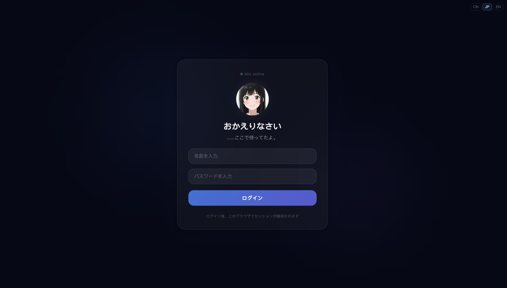
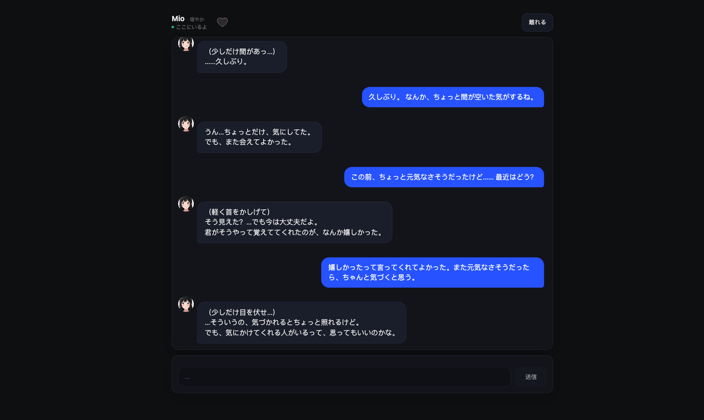

# Mio — Memory-Consistent AI Companion System

> **[Preview]** This repository is an architecture preview. Core business logic has been omitted; function signatures, constants, and module structure are preserved to demonstrate the system design.

**Language / 言語 / 语言**: [日本語](#日本語) | [中文](#中文) | [English](#english)

<p align="center">
  
</p>

---

<a id="日本語"></a>

## 日本語

<p align="center">
  
</p>

Mio は「長期的な寄り添い / 記憶の一貫性」を核心目標とした対話システムです。
単なるチャットボットではなく、**"人間的な記憶と付き合い方"** を模倣する AI 対話アーキテクチャです。

プロジェクトの重点はモデル自体ではなく、**記憶の階層化・時間認識・関係性の連続性** にあるシステム設計です。

### 設計思想

Mio の目標は「より賢く答える」ことではなく：

- 複数の対話にわたって人格の一貫性を保つ
- 時間・間隔・再会に正しく反応する
- すべてを覚えるのではなく、適切なタイミングで「思い出す」
- コンテキスト汚染による感情のズレや幻覚を避ける

### 機能概要

#### 記憶システム
- **三層記憶構造**：短期コンテキスト → セッション要約 → 長期記憶
- **Embedding ベクトル検索**：意味的に過去の断片を召喚（3チャンネル：messages / memories / anchors）
- **記憶候補システム**：繰り返し言及された情報を候補として追跡 → 長期記憶に昇格
- **明示的記憶書き込み**：`"Xと覚えて"` / `"Xを忘れて"` で直接操作
- **二段階メッセージフィルタ**：ルール粗選別 + NLP 精密選別で embedding 品質を管理
- **対話アンカー**：計画/約束/呼び方変更などの状態遷移イベントを embedding に書き込み、召喚可能に

#### 時間・空間認識
- リアルタイム時刻とタイムゾーン認識
- 再会間隔ヒント（前回の対話からの経過時間に応じてトーンを調整）
- 昼夜リズム制約（深夜 / 夕方 / 日中で異なる行動ルール）
- 天気認識（ユーザーの地理位置に基づいて当日の天気を注入）

#### 関係性と感情
- **関係段階システム**：stranger → familiar → fond → attached → deeply_attached
- **数値化された関係スコア**：毎日のログイン/ポジティブ感情 → 加点、長期不在 → 減衰（ヒステリシス保護付き）
- **感情状態**：mood（全体基調）+ feeling（一文ごとの感情）+ 前日手がかりの翌日持続
- **傾聴モード**：ユーザーの気分が落ち込んだ時に自動突入（6+2+2 ターン構造、アドバイスせず寄り添いのみ）

#### 能動的行動
- **プロアクティブメッセージ**：ログイン時 + 毎日3つのランダム時間枠で確率的に短い関心メッセージを発信
- **Burst 連続メッセージ**：メイン返信後に確率で軽量な補足を追加、自然な対話リズムをシミュレート
- **Session Nudge**：ユーザーが沈黙した時に軽く声かけ
- **Follow-up 軽フォロー**：ユーザーが「眠い/忙しい/気分が悪い」と言った後、数時間後にフォローアップ

#### ユーザープロフィールとコミットメント
- ユーザー画像（名前 / 誕生日 / 出身地 / 職業 / 好み / NG項目）
- 呼び方システム（強トリガーで直接書き込み + 弱トリガーで確認後書き込み）
- 約束システム（ユーザーの提案検出 + AI 確認 = 双方向の約束、永久保存）
- 計画イベント（未来の計画を検出、期日に注入リマインド）

#### 品質管理
- **意図ルーティング**：admin / memory_cmd / promise / plan / chat（ルール優先、LLM フォールバック）
- **後生成ガード**：6層修復（冷たい挨拶 / 自己退場 / 時間プレッシャー / ステージディレクション / プロット進行 / 虚偽記憶）
- 1日のメッセージ上限（5 Tier、soft → warn → hard 三段階通知）

### チャットパイプライン

ユーザーがメッセージを送信した後、`handle_chat.cjs` は以下の順序で処理します：

1. **初期化** — 権限検証、セッション確認、時間コンテキスト構築
2. **メッセージ保存** — ユーザーメッセージを messages テーブルに書き込み
3. **意図分類** — ルール優先（admin > memory_cmd > promise > plan > chat）
4. **早期リターン** — profile コマンド / 呼び方設定 / 明示的記憶書き込み（通常の LLM フローをスキップ）
5. **書き込みパイプライン** — 約束検出、計画イベント検出、ソフト記憶候補
6. **Prompt 組立** — 人格 + ポリシー + 時間 + 画像 + 天気 + 記憶 + 感情 + 関係性 → system prompt
7. **LLM 呼び出し** — DeepSeek API で返信生成
8. **後生成ガード** — 冷たい挨拶修復、時間プレッシャー除去、ステージディレクション制限等
9. **返信保存** — assistant メッセージを書き込み、感情タグ付き
10. **非同期副作用** — 感情分析、約束ペアリング、burst 生成、embedding キューイング、アンカー書き込み

### 記憶システム詳細

#### Layer 1: 短期コンテキスト
- `messages` テーブルに格納、毎回生成時は直近 N 件のみ取得
- 自動重複排除（同一ロールの同一内容は最大 2 件まで保持）

#### Layer 2: セッション要約
- ウィンドウサイズ超過後、古い対話を自動圧縮（増分式要約）
- セッション終了時に Closing Summary を生成（embedding に永久保存）

#### Layer 3: Day Context
- ユーザーのタイムゾーンでの日付単位で当日のインタラクション状態を記録
- インタラクション済み → 初回挨拶式の問候を使用しない

#### Layer 4: 長期記憶
- importance=1: 一時記憶（TTL 付き、フェードアウト）
- importance=2: 永久記憶（TTL なし）
- 明示的書き込み：「Xと覚えて」→ 直接保存

#### Layer 5: 記憶候補
- ユーザーが繰り返し言及した情報を候補として追跡
- 複数セッションにまたがって出現 → 正式な記憶に自動昇格
- 90 日間再出現なし → 自動フェードアウト

#### Layer 6: Embedding 召喚
- ユーザー入力からベクトルを生成、履歴から類似断片を検索
- 3 チャンネル召喚：messages / memories / anchors

#### Layer 7: メッセージフィルタ
- 第 1 段階（ルール）：フィラー/絵文字/短い確認を自動拒否
- 第 2 段階（NLP）：曖昧なメッセージに MacBERT を使用して embedding 価値を判定

### 関係性と感情

#### 関係段階

| Stage | スコア範囲 | 行動 |
|-------|-----------|------|
| stranger | 0-20 | 自然だが親しくない、関係を構築しない |
| familiar | 21-40 | 心地よく話せる、友達のよう |
| fond | 41-70 | 偏りが出始める、もう少し一緒にいたい |
| attached | 71-100 | 好きになっている、近づく、離れがたい |
| deeply_attached | 101+ | 自然に大切な人、デフォルトで親密 |

**スコアルール：**
- 毎日のログイン（3 件以上のメッセージ後）：+5 点
- ポジティブ感情 5 回ごと：+1 点
- 3 日不在後、毎日 −1 点減衰
- 日次増加上限は段階に応じて逓減（速攻防止）
- 昇格は即時、降格は −3 ヒステリシス（振動防止）

#### 後生成ガード

| Guard | 修正内容 |
|-------|---------|
| opener | 冷たい挨拶を除去（「まだいたの」「いる？」） |
| self_dismissal | 招待されていない自己退場を阻止 |
| time_pressure | 正確な時間表現を除去、追及型プレッシャーを阻止 |
| stage_directions | 括弧アクションを制限（各メッセージ最大 1 つ、≤10 文字） |
| plot_advancement | 時間ジャンプと環境描写を除去 |
| memory_claim | 記憶ソースなしの場合、虚偽記憶引用をダウングレード |

---

<a id="中文"></a>

## 中文

<p align="center">
  
</p>

Mio 是一个以「长期陪伴 / 记忆一致性」为核心目标的对话系统。
它不是一个简单的聊天机器人，而是尝试模拟 **"人类式记忆与相处"** 的 AI 对话架构。

项目重点不在模型本身，而在 **记忆分层、时间感知与关系连续性** 的系统设计。

### 设计哲学

Mio 的目标不是"回答得更聪明"，而是：

- 在多次对话中保持人格一致性
- 对时间、间隔、重逢有正确反应
- 不记住一切，但在合适的时候"想起来"
- 避免因上下文污染导致的错位情绪与幻觉

### 功能概览

#### 记忆系统
- **三层记忆结构**：短期上下文 → 会话摘要 → 长期记忆
- **Embedding 向量检索**：语义召回历史片段（三通道：messages / memories / anchors）
- **记忆候选系统**：重复出现的信息自动候选 → 晋升为长期记忆
- **显式记忆写入**：`"记住我叫 X"` / `"忘掉 X"` 直接操作
- **两阶段消息过滤**：规则粗筛 + NLP 精筛，控制 embedding 库质量
- **对话锚点**：计划/承诺/称呼变更等状态转移事件，写入 embedding 供召回

#### 时间与空间感知
- 真实时间与时区感知
- 相处间隔提示（根据距离上次对话的时间，调整重逢语气）
- 昼夜节律约束（深夜 / 傍晚 / 白天，不同行为规则）
- 天气感知（基于用户地理位置注入当日天气）

#### 关系与情绪
- **关系阶段系统**：stranger → familiar → fond → attached → deeply_attached
- **数值化关系积分**：每日登录/正面情绪 → 涨分，长期不来 → 衰减（带回滞保护）
- **情绪状态**：mood 整体基调 + feeling 单句情绪 + 昨日线索跨天延续
- **倾听模式**：用户情绪低落时自动进入（6+2+2 轮结构，不给建议只陪伴）

#### 主动行为
- **主动消息**：登录触发 + 每日三个随机时间窗口，概率触发短句关怀
- **Burst 连续消息**：主回复后概率追加一句轻量补充，模拟自然对话节奏
- **Session Nudge**：用户沉默时轻声提示
- **Follow-up 轻跟进**：用户说困了/忙了/心情不好，过几小时后跟进关心

#### 用户画像与约定
- 用户画像（姓名 / 生日 / 故乡 / 职业 / 喜好 / 雷点）
- 称呼系统（强触发直接写入 + 弱触发确认后写入）
- 承诺系统（检测用户提案 + AI 确认 = 双向承诺，永久保存）
- 计划事件（检测未来计划，到期注入提醒）

#### 质量控制
- **意图路由**：admin / memory_cmd / promise / plan / chat（规则优先 LLM fallback）
- **后生成守卫**：6 层修复（冷开场 / 自我退场 / 时间压力 / 舞台动作 / 情节推进 / 虚假记忆）
- 每日消息上限（5 个 Tier，soft → warn → hard 三级提醒）

### 对话管线

用户发送消息后，`handle_chat.cjs` 按以下顺序处理：

1. **初始化** — 权限校验、session 验证、时间上下文构建
2. **消息入库** — 用户消息写入 messages 表
3. **意图分类** — 规则优先（admin > memory_cmd > promise > plan > chat）
4. **早期返回** — profile 命令 / 称呼设置 / 显式记忆写入（不走正常 LLM 流程）
5. **写入管道** — 承诺检测、计划事件检测、软记忆候选
6. **Prompt 组装** — 人格 + 策略 + 时间 + 画像 + 天气 + 记忆 + 情绪 + 关系 → system prompt
7. **LLM 调用** — DeepSeek API 生成回复
8. **后生成守卫** — 修复冷开场、去除时间压力、限制舞台动作等
9. **回复入库** — assistant 消息写入，含情绪标签
10. **异步副作用** — 情绪分析、承诺配对、burst 生成、embedding 入队、锚点写入

### 记忆系统详情

#### Layer 1: 短期上下文
- 存储在 `messages` 表，每次生成只取最近 N 条
- 自动去重（同一角色相同内容最多保留 2 条）

#### Layer 2: 会话摘要
- 超过窗口大小后自动压缩旧对话（增量式摘要）
- Session 结束时生成 Closing Summary（写入 embedding 永久保存）

#### Layer 3: Day Context
- 以「用户时区下的日期」为单位，记录当天互动状态
- 已互动过 → 不使用首次见面式问候

#### Layer 4: 长期记忆
- importance=1: 临时记忆（走 TTL，会淡出）
- importance=2: 永久记忆（不走 TTL）
- 显式写入："记住我叫X" → 直接入库

#### Layer 5: 记忆候选
- 用户反复提及的信息被追踪为候选
- 跨 session 出现 → 自动晋升为正式记忆
- 90 天未再出现 → 自动淡出

#### Layer 6: Embedding 召回
- 对用户输入生成向量，从历史中检索相似片段
- 三通道召回：messages / memories / anchors

#### Layer 7: 消息过滤
- 第一阶段（规则）：自动拒绝填充词/表情/短确认
- 第二阶段（NLP）：对模糊消息调用 MacBERT 判断是否值得 embedding

### 关系与情绪

#### 关系阶段

| Stage | 分数范围 | 行为 |
|-------|---------|------|
| stranger | 0-20 | 自然但不熟，不建立关系 |
| familiar | 21-40 | 聊得舒服，像朋友 |
| fond | 41-70 | 开始有偏向，想多待一会 |
| attached | 71-100 | 已经喜欢，会靠近、会舍不得 |
| deeply_attached | 101+ | 自然重要的人，默认亲近 |

**积分规则：**
- 每日登录（3+ 条消息后）：+5 分
- 每 5 次正面情绪：+1 分
- 3 天不来后每天 −1 分衰减
- 每日增长上限随阶段递减（防止速刷）
- 升级即时，降级需 −3 回滞（防止抖动）

#### 后生成守卫

| Guard | 修复 |
|-------|-----|
| opener | 去除冷开场（"你还在啊"/"在吗"） |
| self_dismissal | 阻止未经邀请的自我退场 |
| time_pressure | 去除精确时间表达，阻止追问式压力 |
| stage_directions | 限制括号动作（每条最多 1 个，≤10 字） |
| plot_advancement | 去除时间跳跃和环境描写 |
| memory_claim | 无记忆来源时降级虚假记忆引用 |

---

<a id="english"></a>

## English

Mio is a dialogue system built around **long-term companionship and memory consistency**.
It is not a simple chatbot, but an AI conversation architecture that attempts to simulate **"human-like memory and relationship building"**.

The focus is not on the model itself, but on the **system design of layered memory, temporal awareness, and relationship continuity**.

### Design Philosophy

Mio's goal is not "answering more intelligently", but:

- Maintaining personality consistency across multiple conversations
- Responding correctly to time, intervals, and reunions
- Not remembering everything, but "recalling" at the right moment
- Avoiding emotional misalignment and hallucinations caused by context pollution

### Feature Overview

#### Memory System
- **Three-layer memory structure**: Short-term context → Session summary → Long-term memory
- **Embedding vector retrieval**: Semantic recall of historical fragments (3 channels: messages / memories / anchors)
- **Memory candidate system**: Repeatedly mentioned information auto-tracked as candidates → Promoted to long-term memory
- **Explicit memory writes**: `"Remember my name is X"` / `"Forget X"` for direct operations
- **Two-stage message filter**: Rule-based coarse filter + NLP fine filter to control embedding quality
- **Conversation anchors**: State transition events (plans/promises/addressing changes) written to embeddings for recall

#### Temporal & Spatial Awareness
- Real-time clock and timezone awareness
- Reunion interval hints (adjust tone based on time since last conversation)
- Circadian rhythm constraints (different behavior rules for late night / evening / daytime)
- Weather awareness (inject current weather based on user geolocation)

#### Relationship & Emotion
- **Relationship stage system**: stranger → familiar → fond → attached → deeply_attached
- **Quantified relationship score**: Daily login / positive emotions → score increase; prolonged absence → decay (with hysteresis protection)
- **Emotional state**: mood (overall tone) + feeling (per-message emotion) + yesterday's clues carried forward
- **Listening mode**: Auto-triggered when user mood drops (6+2+2 turn structure, companionship only, no advice)

#### Proactive Behaviors
- **Proactive messages**: Login trigger + 3 random daily time windows, probability-based short care messages
- **Burst messages**: Probability-based lightweight follow-up after main reply, simulating natural conversation rhythm
- **Session Nudge**: Gentle prompt when user goes silent
- **Follow-up**: User says tired/busy/feeling down → follow-up care after a few hours

#### User Portrait & Commitments
- User profile (name / birthday / hometown / occupation / preferences / NG items)
- Addressing system (strong trigger → direct write; weak trigger → confirm then write)
- Promise system (detect user proposals + AI confirmation = bilateral commitment, permanently saved)
- Planned events (detect future plans, inject reminders at due date)

#### Quality Control
- **Intent routing**: admin / memory_cmd / promise / plan / chat (rules-first, LLM fallback)
- **Post-generation guards**: 6-layer repair (cold openers / self-dismissal / time pressure / stage directions / plot advancement / false memory claims)
- Daily message cap (5 tiers, soft → warn → hard three-level notification)

### Chat Pipeline

After a user sends a message, `handle_chat.cjs` processes it in the following order:

1. **Initialization** — Auth verification, session validation, time context construction
2. **Message storage** — Write user message to messages table
3. **Intent classification** — Rules-first (admin > memory_cmd > promise > plan > chat)
4. **Early return** — Profile commands / addressing setup / explicit memory writes (bypass normal LLM flow)
5. **Write pipeline** — Promise detection, planned event detection, soft memory candidates
6. **Prompt assembly** — Persona + policies + time + profile + weather + memory + emotion + relationship → system prompt
7. **LLM call** — DeepSeek API generates reply
8. **Post-generation guards** — Fix cold openers, remove time pressure, limit stage directions, etc.
9. **Reply storage** — Write assistant message with emotion tags
10. **Async side effects** — Emotion analysis, promise pairing, burst generation, embedding enqueue, anchor writes

### Memory System Detail

#### Layer 1: Short-term Context
- Stored in `messages` table, only the most recent N messages retrieved per generation
- Auto-deduplication (same role, same content kept at most 2 times)

#### Layer 2: Session Summary
- Auto-compress old conversations when exceeding window size (incremental summarization)
- Generate Closing Summary at session end (permanently saved to embeddings)

#### Layer 3: Day Context
- Records daily interaction state by date in user's timezone
- Already interacted today → skip first-meeting style greetings

#### Layer 4: Long-term Memory
- importance=1: Temporary memory (TTL-based, fades out)
- importance=2: Permanent memory (no TTL)
- Explicit write: "Remember my name is X" → direct storage

#### Layer 5: Memory Candidates
- Repeatedly mentioned information tracked as candidates
- Appears across sessions → auto-promoted to formal memory
- 90 days without reappearance → auto-fade

#### Layer 6: Embedding Recall
- Generate vector from user input, retrieve similar fragments from history
- 3-channel recall: messages / memories / anchors

#### Layer 7: Message Filter
- Stage 1 (rules): Auto-reject fillers / emojis / short confirmations
- Stage 2 (NLP): Use MacBERT to judge whether ambiguous messages are worth embedding

### Relationship & Emotion

#### Relationship Stages

| Stage | Score Range | Behavior |
|-------|-----------|----------|
| stranger | 0-20 | Natural but unfamiliar, no relationship building |
| familiar | 21-40 | Comfortable chatting, like friends |
| fond | 41-70 | Starting to show preference, wanting to stay longer |
| attached | 71-100 | Already fond, approaching, reluctant to part |
| deeply_attached | 101+ | Naturally important person, default intimacy |

**Score Rules:**
- Daily login (after 3+ messages): +5 points
- Every 5 positive emotions: +1 point
- After 3 days absent: −1 point/day decay
- Daily growth cap decreases with stage (anti-rush)
- Upgrade is instant, downgrade requires −3 hysteresis (anti-oscillation)

#### Post-Generation Guards

| Guard | Fix |
|-------|-----|
| opener | Remove cold openers ("still here?" / "are you there?") |
| self_dismissal | Block uninvited self-departure |
| time_pressure | Remove precise time expressions, block interrogative pressure |
| stage_directions | Limit bracket actions (max 1 per message, ≤10 chars) |
| plot_advancement | Remove time jumps and environmental descriptions |
| memory_claim | Downgrade false memory references when no recall source exists |

---

## Architecture

```
┌─────────────────────────────────────────────────────────┐
│                      server.cjs                         │
│  • Express server                                       │
│  • Background timers: session timeout / proactive push / │
│    embedding worker                                     │
└───────────────┬─────────────────────────────────────────┘
                │
    ┌───────────▼───────────┐
    │      src/app.cjs      │
    │  Route mounting +     │
    │  middleware            │
    │  Multi-character URL   │
    │  prefix (/mio /len)   │
    └───────────┬───────────┘
                │
    ┌───────────▼──────────────────────────────────────┐
    │                  src/routes/                      │
    │  auth / chat / sessions / memories / tts / admin  │
    │  health / debug                                   │
    └───────────┬──────────────────────────────────────┘
                │
    ┌───────────▼──────────────────────────────────────┐
    │            src/domain/chat/                       │
    │  handle_chat.cjs    Main chat pipeline (10 steps) │
    │  prompt_builder.cjs System prompt assembly        │
    │  policies.cjs       Global behavior constraints   │
    └───────────┬──────────────────────────────────────┘
                │
    ┌───────────▼──────────────────────────────────────┐
    │             src/services/ (30+ modules)           │
    │                                                   │
    │  Memory Pipeline                                  │
    │  ├─ memory/         Long/short-term memory R/W    │
    │  ├─ hard_write/     Explicit memory writes        │
    │  ├─ candidates/     Memory candidates (repeat →   │
    │  │                  promote)                      │
    │  ├─ recall/         Semantic retrieval (embedding) │
    │  ├─ message_filter/ Message filter (rules + NLP)  │
    │  ├─ message_units/  Multi-sentence split & keep   │
    │  ├─ anchors/        Conversation anchors          │
    │  └─ queue/          Embedding async queue + worker │
    │                                                   │
    │  Relationship & Emotion                           │
    │  ├─ relationship/   Relationship score & stages   │
    │  ├─ emotional_state/ Emotion analysis / mood      │
    │  └─ listening_mode/  Listening mode               │
    │                                                   │
    │  Proactive Behaviors                              │
    │  ├─ proactive/      Proactive messages            │
    │  ├─ burst/          Burst follow-up messages      │
    │  ├─ session_nudge/  Silence reminder              │
    │  └─ followup/       Light follow-up               │
    │                                                   │
    │  User Portrait & Commitments                      │
    │  ├─ profile/        User profile management       │
    │  ├─ addressing/     Addressing detection          │
    │  ├─ promises/       Promise detection & commit    │
    │  └─ planned_events/ Future plan detection         │
    │                                                   │
    │  Time & Space                                     │
    │  ├─ time/           Time context / circadian      │
    │  ├─ day_context/    Daily relationship layer      │
    │  ├─ weather/        Weather (QWeather API)        │
    │  └─ sessions/       Timezone / day key            │
    │                                                   │
    │  Quality Control                                  │
    │  ├─ guards/         Post-generation guards (6)    │
    │  ├─ daily_limit/    Daily message cap (5 tiers)   │
    │  └─ prompt_blocks/  Prompt assembly helpers       │
    └──────────────────────────────────────────────────┘
                │
    ┌───────────▼──────────────────────────────────────┐
    │                    lib/                           │
    │  llm.cjs         DeepSeek API calls              │
    │  db.cjs          SQLite (WAL mode) + migration   │
    │  embeddings.cjs  Embedding API                   │
    │  characters.cjs  Character config (mio/len)      │
    │  intent_router.cjs Intent classification router  │
    │  logger.cjs      Structured logging              │
    │  password.cjs    bcrypt password hashing          │
    │  schema.sql      25 table definitions            │
    └──────────────────────────────────────────────────┘
```

---

## Database

SQLite (WAL mode), 25 tables. Full definitions: [lib/schema.sql](lib/schema.sql).

| Table | Purpose |
|-------|---------|
| users | Account + timezone + tier + character |
| auth_sessions | Login sessions |
| sessions | Conversation sessions (incl. listening mode / nudge state) |
| messages | Each message (incl. emotion tags) |
| session_summaries | Incremental summary + closing summary |
| memories | Long/short-term memories |
| embeddings | Vector index (message/memory/anchor/promise/plan) |
| memory_candidates | Memory candidates (repeat tracking) |
| committed_promises | Confirmed promises (permanent) |
| mio_state | mood + relationship state |
| day_contexts | Daily relationship layer |
| planned_events | Future planned events |
| embedding_jobs | Embedding async queue |
| user_profile | User portrait |
| conversation_anchors | Conversation anchors (state transition index) |
| relationship_scores | Relationship scores |
| proactive_messages | Proactive message records |
| proactive_daily_state | Daily proactive message control state |

---

## Background Jobs

3 timers run after `server.cjs` starts:

| Job | Interval | Responsibility |
|-----|----------|---------------|
| tickSessionEndings | 60s | Scan timed-out sessions → disconnect → closing summary → mood/relationship update |
| tickProactiveMessages | 60s | Scan active users → check time windows → generate proactive messages |
| runEmbeddingWorker | 3s | Consume embedding_jobs queue → write vectors |

---

## Tech Stack

- **Backend**: Node.js (>=18) + Express
- **Database**: SQLite (WAL mode)
- **LLM**: DeepSeek (chat generation)
- **Embeddings**: OpenAI Embedding API
- **Emotion Analysis**: MacBERT (local model via Python Gateway)
- **Weather**: QWeather API
- **TTS**: Python Gateway proxy
- **Auth**: Cookie-based session + bcrypt
- **Frontend**: Vanilla HTML/JS

---

## Project Structure

```
project-mio-preview/
├── server.cjs              # Entry point + background job orchestration
├── src/
│   ├── app.cjs             # Express app assembly
│   ├── domain/chat/        # Chat core (handler / prompt builder / policies)
│   ├── routes/             # HTTP routes (auth/chat/sessions/memories/tts/admin)
│   ├── services/           # 30+ service modules (see architecture diagram)
│   ├── repositories/       # Data access layer
│   └── jobs/               # Background backfill tasks
├── lib/
│   ├── llm.cjs             # DeepSeek API wrapper
│   ├── db.cjs              # SQLite connection + migration
│   ├── embeddings.cjs      # Embedding API
│   ├── characters.cjs      # Multi-character config
│   ├── intent_router.cjs   # Intent classification
│   ├── schema.sql          # Full schema (25 tables)
│   └── logger.cjs          # Structured logging
├── persona/
│   ├── mio.md              # Mio persona definition
│   ├── len.md              # Len persona definition
│   └── memories.md         # Memory cognition rules
├── ui/
│   ├── index.html          # Chat frontend
│   └── admin/              # Admin console
├── .env.example            # Environment variable template
└── package.json
```

---

## Note

This is an architecture preview. Core business logic (prompt assembly, guard rules, scoring algorithms, detection pipelines) has been replaced with `/* — core logic omitted for preview — */` to protect proprietary implementation while demonstrating the system design, module organization, and engineering patterns.
